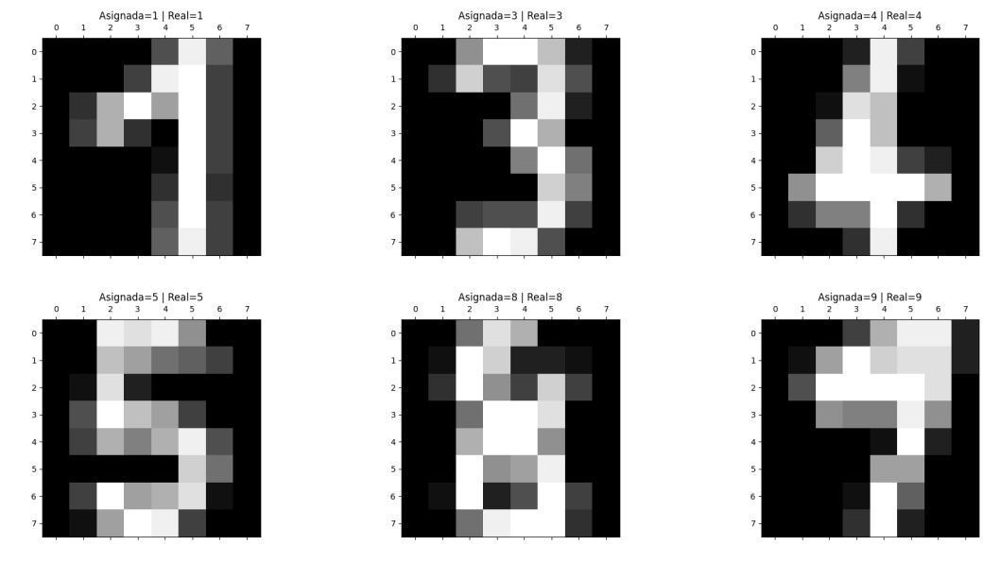

# Image Classification

Solve classification tasks using different algorithms working on the Optical Recognition of Handwritten Digits Data Set (optdigits), which is a 10-class problem and the data is represented by 64 features (8x8 images).

The algorithms to be developed to generate the model are:
* KNN (K-Nearest Neighbor).
* Naive-Bayes
* Parallel Perceptron

Once any of the algorithms are developed, solve the image classification as follows:
* First, load only the test data from the optdigits dataset (1797 records).
* Then, randomly divide the dataset into a training and a test set, both stratified.
* After that, train the algorithm with the training set.
* Next, obtain the accuracy of the training and test data.
* Finally, display n random images from the test set, their actual labels and the prediction made by the model.

An example of the expected results are:

