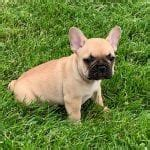
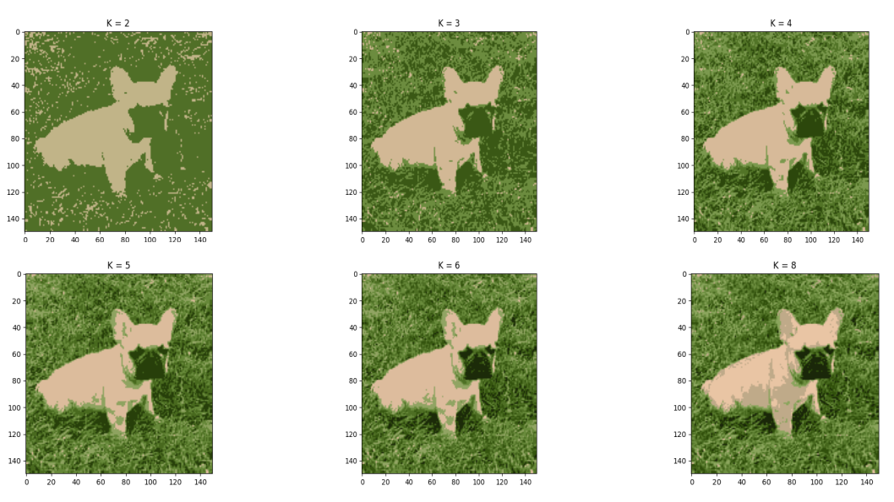

# Image Segmentation

Solve clustering tasks using different algorithms on any image in order to perfom segmentation.
The image segmentation is a process that divides an image into regions of n colors, and an image is
made up of pixels, which have 3 channels to define its color (RGB - red, green and blue).

An example of what is expected to be achieved is as follows:

Original image:  

Expected result: 

The algorithms to be developed to generate the model are:
* K-Means.
* DBSCAN

Once any of the algorithms are developed, solve the image segmentation as follows:
* First, load any image
* Then, create the dataset from the image pixels. Each data must be represented by 3 features (R, G, B)
* After that, generate the clusters using the algorithm.
* Once the clusters are generated, assign a color tone according to the group each pixel belongs.
* Finally, display the image colored with n tones for the different regions.