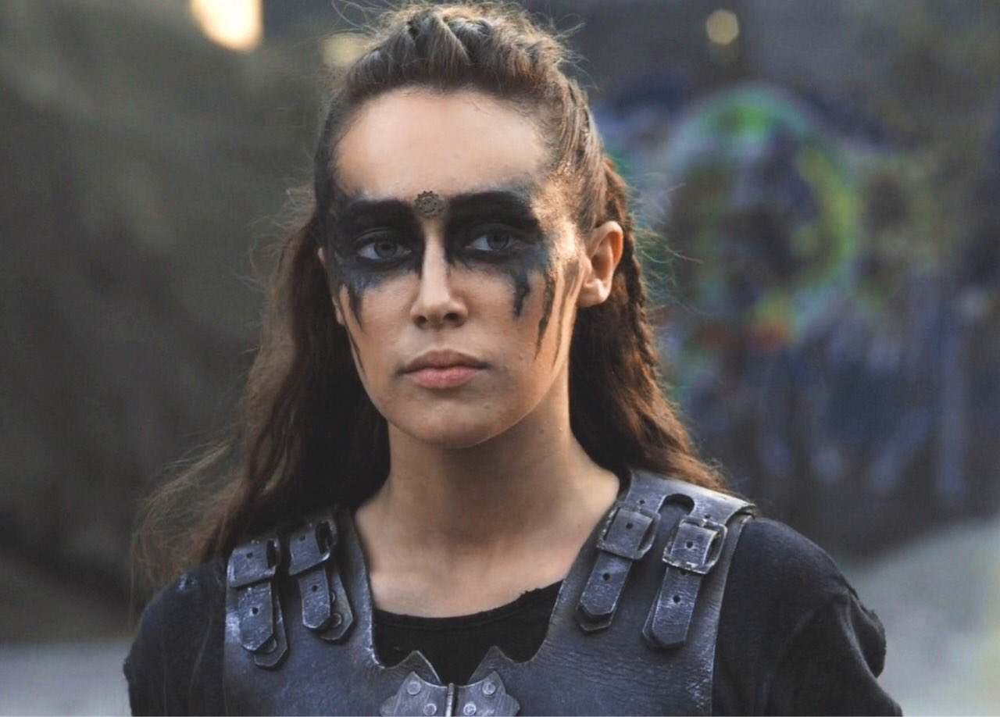
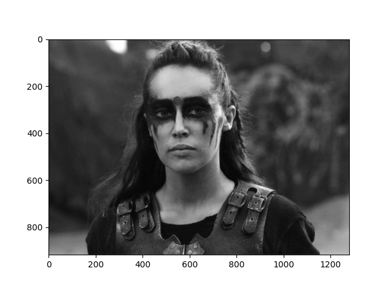
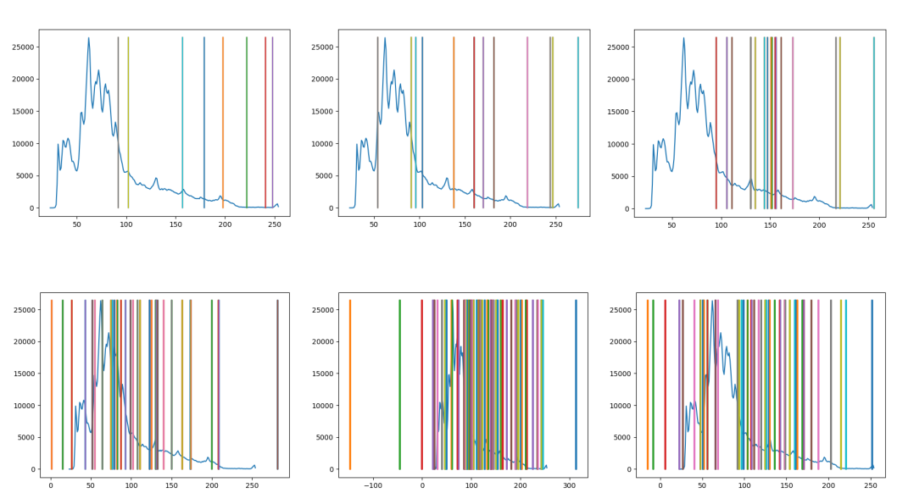
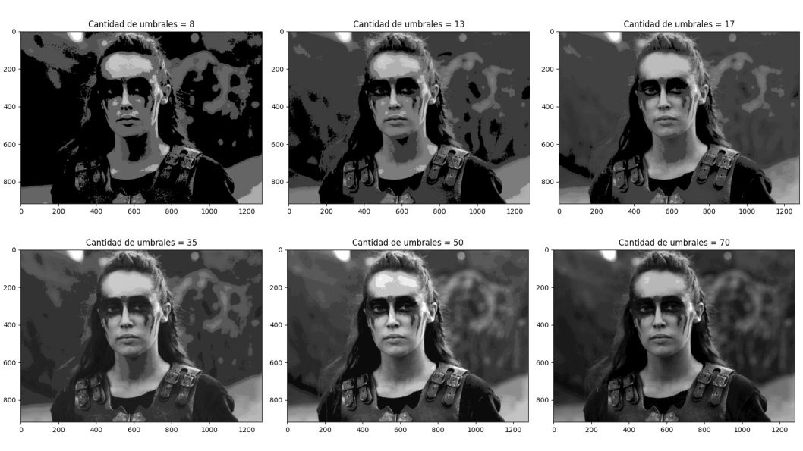

# Multilevel Image Thresholding

Solve optimization tasks using algorithms to any image in order to perfom multilevel image thresholding. Thresholding is a process that transforms a grayscale image into one with only two levels of color, separating the objects from the background.

For this purpose, Otsu's method will be used to automatically determine the threshold of an image, and uses the mean and standard deviation of the gray level segments into which the image is separated according to the threshold T.

Otsu's method is based on the histogram, which is calculated from the gray levels of an image that are then classified into 2 or more groups according to the number of thresholds.

An example of what is expected to be achieved is as follows:

Original image:  

Grayscale image:  

Histogram Generation:  

Expected result:  

The algorithms to be developed to generate the model are:
* UMDA (Univariate Marginal Distribution Algorithm)
* Genetic Algorithm
* PSO (Particle Swarm Optimization)

Once any of the algorithms are developed, solve the ultilevel image thresholding as follows:
* First, load any image and convert it to grayscale
* Then, create the dataset from the image pixels.
* After that, calculate the thresholds by evaluating Otsu's method.
* Next, obtain frequencies for histogram.
* Finally, display the histogram and the image colored.